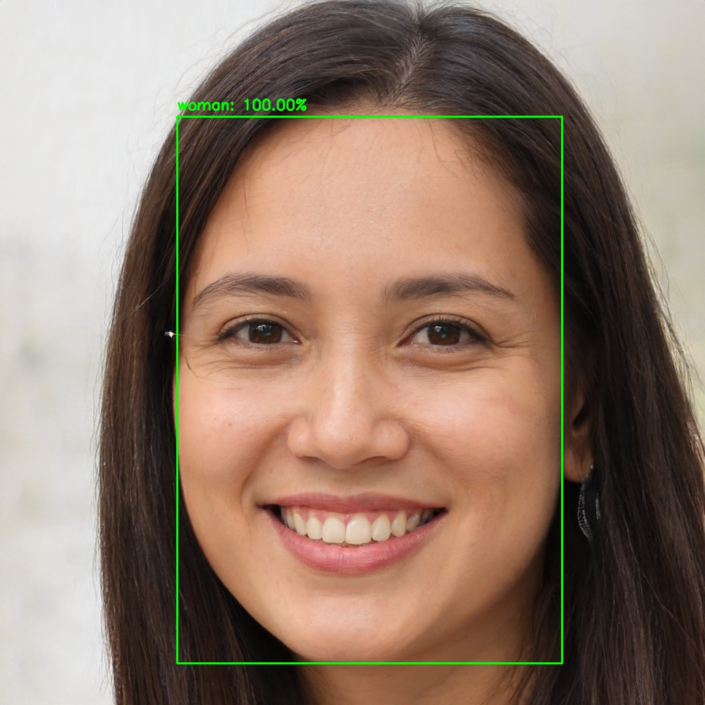

# Gender recognition with Keras
This repository was forked from @arunponnusamy 's https://github.com/arunponnusamy/gender-detection-keras. Significant changes such as a command line tool for gender-based file management have been added.

This tool can be really powerful for data cleaning. If you have a mixed dataset and just need pictures of one of the genders, you can easily get rid of the unnecesary images. It can also delete pictures with more than one person, or all associated metadata files (such as .txt or .json).

## Python packages
* numpy
* opencv-python
* tensorflow
* keras
* requests
* progressbar
* cvlib

Install the required packages by executing the following command.

`$ pip install -r requirements.txt`

**Note: Python 2.x is not supported** 
Using **Python virtual environment** is highly recommended.

## Usage
optional arguments:
  -h, --help            show this help message and exit
  -i IMAGE, --image IMAGE
                        path to input image
  -d DIR, --dir DIR     path to input directory
  -m, --nomen           Delete men pictures
  -w, --nowomen         Delete women pictures
  -o, --oneperson       Delete pictures with more than one person
  -t, --nometadata      Delete all metadata files
  --hide                Hide output
  
### image input
`$ python gender_recognition.py -i <input_image>`

### directory input
Activating option -d will loop through the specified directory, running the script for each image.
`$ python gender_recognition.py -d <input_directory>`

### webcam
`$ python gender_recognition_webcam.py`

When you run the script for the first time, it will download the pre-trained model from this [link](https://github.com/arunponnusamy/cvlib/releases/download/v0.2.0/gender_detection.model) and place it under `pre-trained` directory in the current path.

(If `python` command invokes default Python 2.7, use `python3` instead)

### Sample output :

## Training
You can download the dataset I gathered from Google Images from this [link](https://github.com/arunponnusamy/gender-detection-keras/releases/download/v0.1/gender_dataset_face.zip) and train the network from scratch on your own if you are interested. You can add more images and play with the hyper parameters to experiment different ideas. 

### Additional packages
* scikit-learn
* matplotlib

Install them by typing `pip install scikit-learn matplotlib`

### Usage
Start the training by running the command

`$ python train.py -d <path-to-dataset>`

(i.e) _$ python train.py -d ~/Downloads/gender_dataset_face/_

Depending on the hardware configuration of your system, the execution time will vary. On CPU, training will be slow. After the training, the model file will be saved in the current path as `gender_detection.model`.

If you have an Nvidia GPU, then you can install `tensorflow-gpu` package. It will make things run a lot faster.

## Help
If you are facing any difficulty, feel free to create a new [issue](https://github.com/javiermunooz/gender_recognition/issues) .
